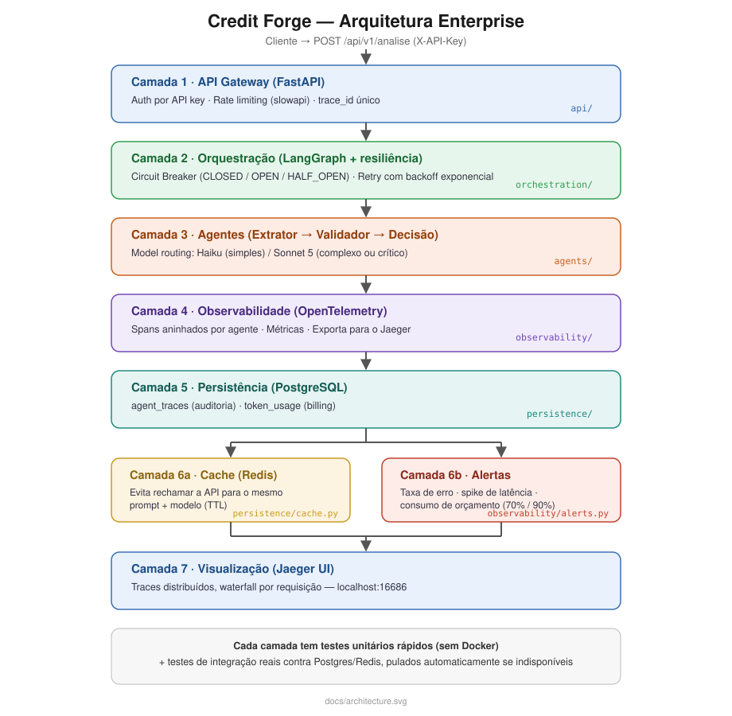

# Credit Forge

Sistema multiagente de análise de crédito B2B, com arquitetura enterprise de 7 camadas:
API Gateway, orquestração resiliente, agentes LLM com model routing, observabilidade
distribuída (OpenTelemetry + Jaeger), persistência (PostgreSQL), cache (Redis) e alertas.

Um documento de crédito entra em texto livre; o sistema extrai os dados, valida a
coerência entre eles e devolve uma decisão de risco (**Baixo / Médio / Alto**) com motivo e
nível de confiança — tudo rastreável, auditável e testado de ponta a ponta.

```
"Empresa: Tech Startup XYZ. Faturamento anual: R$ 2.5M. Anos no mercado: 3.        Extrator
 Histórico de pagamento: 3 atrasos em 24 meses. Dívida atual: R$ 150k.       ──▶   Validador  ──▶  { "decisao_final": "Risco Médio",
 Capital social: R$ 500k."                                                        Decisão            "motivo": "...", "confianca": 0.88 }
```

## Por que este projeto existe

Nasceu como um projeto de estudo  e evoluiu em 3 fases:

1. **Pipeline básico** — 3 agentes (Extrator → Validador → Decisão) orquestrados via
   LangGraph, com avaliação formal (accuracy/F1) contra um dataset golden e observabilidade
   de custo/latência.
2. **Inteligência de agentes**  — memória de sessão, self-reflection
   (o sistema critica a própria decisão) e model routing por complexidade.
3. **Arquitetura enterprise**  — API HTTP, resiliência
   (circuit breaker + retry), tracing distribuído, persistência, cache e alertas — o mesmo
   tipo de infraestrutura usada em sistemas de crédito de produção.

Três variantes do pipeline convivem no mesmo código, para comparação:

| Variante | O que usa | Custo |
|---|---|---|
| **Mock** | Regras determinísticas (regex + fórmulas), sem LLM | Grátis |
| **Real** | Claude (`claude-haiku-4-5`) via API da Anthropic | ~$0.04 / 15 casos |
| **Real + Camada 1** | + memória, self-reflection, model routing (Haiku/Sonnet 5) | ~$0.09 / 15 casos |

## Arquitetura



Cada camada tem testes próprios e rápidos (sem depender de Docker) e, quando faz sentido, um
teste de integração real contra Postgres/Redis — pulado automaticamente se a infraestrutura
não estiver disponível, então a suíte nunca quebra por falta de Docker (inclusive no CI).

## Pré-requisitos

| Para... | Você precisa de |
|---|---|
| Rodar o pipeline mock (sem custo) | Python 3.12+ |
| Rodar o pipeline real | + uma chave de API da Anthropic |
| Rodar a pilha enterprise completa | + Docker Desktop (Postgres, Redis, Jaeger, e a API em containers) |

## Instalação

```powershell
git clone <url-do-repositorio>
cd credit-forge

python -m venv .venv
.venv\Scripts\pip install -r requirements.txt
```

Crie um arquivo `.env` na raiz (nunca commitado — está no `.gitignore`) com sua chave da
Anthropic:

```
ANTHROPIC_API_KEY=sk-ant-...
```

## Como rodar

Os scripts em `scripts/` importam pacotes da raiz do projeto (`orchestration`, `agents`, ...)
e por isso rodam como **módulo**, com `-m` — `python scripts/run_mock.py` direto falharia
(`ModuleNotFoundError`), porque nesse modo só a pasta `scripts/` entra no import path.

### Modo rápido (sem Docker)

```powershell
# Pipeline 100% mock -- grátis, sem chamadas de rede
.venv\Scripts\python.exe -m scripts.run_mock

# Relatório de avaliação (accuracy/F1 + confiança + custo/latência por agente)
.venv\Scripts\python.exe -m evaluation.evaluator

# Pipeline real -- gasta créditos da API (teto de orçamento configurável)
.venv\Scripts\python.exe -m scripts.run_real
.venv\Scripts\python.exe -m scripts.run_real --limite 0.50

# Pipeline real + Camada 1 (memória, self-reflection, model routing)
.venv\Scripts\python.exe -m scripts.run_real_camada1
```

### Pilha enterprise completa (Docker)

```powershell
docker compose up -d      # sobe Jaeger + PostgreSQL + Redis + a própria API
docker compose ps          # confirma os 4 serviços saudáveis
```

| Serviço | Endereço | O que é |
|---|---|---|
| API | `http://localhost:8000` | `GET /health`, `POST /api/v1/analise`, `GET /audit/trace/{id}`, `GET /costs/by-client` |
| Jaeger UI | `http://localhost:16686` | Traces distribuídos (serviço `credit-forge`) |
| PostgreSQL | `localhost:5433` | usuário/senha/banco: `credit_forge` |
| Redis | `localhost:6380` | Cache de prompt |

`docker compose` lê o `.env` da raiz automaticamente (`ANTHROPIC_API_KEY`, `API_KEYS`, etc.).

```powershell
# Roda os 15 casos do dataset golden via HTTP, contra a pilha inteira
.venv\Scripts\python.exe -m scripts.run_enterprise_demo
```

```powershell
docker compose down        # derruba tudo quando terminar
```

**Exemplo de chamada manual** (use `curl.exe`, não o alias `curl` do PowerShell — esse alias
é na verdade `Invoke-WebRequest`, com sintaxe de flags diferente):

```powershell
curl.exe -X POST http://localhost:8000/api/v1/analise `
  -H "Content-Type: application/json" -H "X-API-Key: dev-key-local" `
  -d '{"documento": "Empresa: Tech Startup XYZ. Faturamento anual: R$ 2.5M. Anos no mercado: 3. Historico de pagamento: 3 atrasos em 24 meses. Divida atual: R$ 150k. Capital social: R$ 500k.", "cliente": "meu-teste"}'
```

## Como testar

```powershell
.venv\Scripts\python.exe -m pytest              # suíte completa (~90 testes, roda em segundos)
.venv\Scripts\python.exe -m pytest -v            # com nome de cada teste
.venv\Scripts\python.exe -m pytest tests/test_api.py            # só a API
.venv\Scripts\python.exe -m pytest tests/test_orchestration.py   # só circuit breaker/retry
.venv\Scripts\python.exe -m pytest tests/test_persistence.py      # inclui 1 teste real c/ Postgres
.venv\Scripts\python.exe -m pytest tests/test_cache.py              # inclui 1 teste real c/ Redis
```

A suíte roda **sem Docker** (os testes de integração real contra Postgres/Redis se auto-pulam
se a infraestrutura não estiver acessível — não precisa subir nada para rodar `pytest`).
Com `docker compose up -d` rodando, esses testes de integração também executam de verdade.

## Resultados (15 casos de teste, dataset golden)

| | Mock | Real (Haiku 4.5) | Real + Camada 1 | Enterprise (containerizado)¹ |
|---|---|---|---|---|
| Accuracy | 0.933 | 0.933 | **1.000** | 0.867 |
| Latência por caso | ~0.07 ms | ~4.3 s | ~7.2 s | P50 3.9s / P95 4.8s (via HTTP) |
| Custo total (15 casos) | $0.00 | ~$0.04 | ~$0.09 | $0.0381 |

¹ Mesmo pipeline do "Real (Haiku 4.5)" (`construir_grafo_real`), servido via
`POST /api/v1/analise` contra a pilha inteira em containers. Errou 2 casos nesta rodada
específica (a Etapa 15 havia errado só 1) — **variabilidade real do LLM entre execuções**, não
regressão de código: mesmo pipeline, mesmos prompts, resposta do modelo varia entre chamadas.
É por isso que avaliação estatística (várias rodadas) diz mais que confiar num único resultado.

A versão **Real + Camada 1** é a única que chegou a 100% — ao custo de ~2x mais tempo/dinheiro
por caso (memória de sessão + self-reflection + possível 2ª chamada de revisão).

## Estrutura do projeto

```
api/                       # Camada 1: FastAPI Gateway
├── main.py                  # app, POST /api/v1/analise, GET /health, GET /audit/*, GET /costs/*
├── deps.py                   # injeção de dependência: client, verificador, circuit breaker, DB, auth
└── schemas.py                 # contratos HTTP (request/response) -- distintos dos de domínio
orchestration/              # Camada 2: LangGraph + resiliência
├── graph.py                  # grafo (mock, real, real+Camada 1) + nós dos agentes
├── circuit_breaker.py         # CircuitBreaker (CLOSED/OPEN/HALF_OPEN)
└── retry.py                    # retry com backoff (tenacity) + fallback de modelo
agents/                     # Camada 3: agentes + model routing
├── base.py                   # LLMAgent (Template Method) -- infra de chamada compartilhada
├── extrator.py, validator.py, decision.py   # mock + real de cada agente
├── memory.py                   # memória de sessão (Camada 1)
└── routing.py                   # model routing: Haiku vs Sonnet 5 por complexidade
observability/              # Camada 4 (+ parte da 6b)
├── tracing.py                 # OpenTelemetry: spans, exportador console/OTLP-Jaeger
├── metrics.py                  # histogramas/counters (OTel Meter)
├── alerts.py                    # Notifier abstrato + ConsoleNotifier + monitor de saúde
├── tracking.py                   # custo/latência/guardião de orçamento
└── logger.py                      # logging estruturado em JSON
persistence/                # Camada 5 (+ 6a)
├── models.py                  # SQLAlchemy: AgentTraceDB, TokenUsage, PromptCache
├── db.py                        # engine/session (Postgres real ou SQLite p/ testes)
├── audit.py                      # write-path/read-path de auditoria
└── cache.py                       # PromptCacheBackend abstrato + Redis + em-memória
data/                        # Contratos de domínio (Pydantic) + dataset golden (15 casos)
evaluation/                  # accuracy/precision/recall/F1 (golden dataset)
tests/                       # pytest: ~90 testes (unitários + integração real opcional)
scripts/                     # pontos de entrada (rodar com `python -m scripts.X`)
docker-compose.yml           # Jaeger + PostgreSQL + Redis + a própria API
Dockerfile                    # imagem da API
.github/workflows/ci.yml       # pytest + build da imagem
docs/                          # roteiros de evolução do projeto + diagrama de arquitetura
```

## Decisões de projeto

- **Mock antes de real, sempre**: cada peça nova (schemas → agentes → orquestração →
  observabilidade → persistência → cache → alertas) foi validada isoladamente (regras
  determinísticas ou um cliente/backend falso) antes de conectar em algo que gasta créditos
  ou depende de infraestrutura real.
- **`claude-haiku-4-5`** como padrão, **`claude-sonnet-5`** para o Decisor (Camada 1) e para
  casos roteados como complexos — troca do par Sonnet/Opus do roteiro original, para caber no
  orçamento de créditos do projeto.
- **Injeção de dependência em todo canto**: client Anthropic, guardião de orçamento, circuit
  breaker, tracer/meter do OpenTelemetry, sessão de banco, backend de cache, notifier de
  alertas — tudo substituível via `Depends()` (API) ou parâmetro de construtor (fora dela). É
  o que permite testar cada camada sem gastar créditos nem precisar de Docker.
- **Baselines congelados**: `construir_grafo_real` (o pipeline "Real" básico) nunca muda de
  comportamento depois de validado — melhorias novas (Camada 1, cache) entram como
  variantes/parâmetros opt-in, nunca como mudança silenciosa do que já foi medido.
- **`agents/base.py` (Template Method)**: a lógica de "chamar a API, checar truncamento,
  limpar JSON, validar no schema, registrar custo, aplicar retry, checar cache" existe em UM
  lugar (`LLMAgent.executar`) — cada agente só define o que é específico dele.
- **Testes de integração real, nunca obrigatórios**: os testes contra Postgres/Redis reais se
  auto-pulam quando a infraestrutura não está acessível — `pytest` nunca quebra por falta de
  Docker, nem no CI.

## Camada 1 — Inteligência de Agentes 

- **Agent Memory** (`agents/memory.py`): memória de sessão entre casos (não uma "conversa"
  dentro de 1 caso) — comprimida por uma chamada real ao Claude quando cresce demais.
- **Self-Reflection Loop** (`agents/decision.py`): uma 2ª chamada critica a decisão original;
  se encontrar inconsistências, uma 3ª chamada gera a decisão revisada (limitado a 1 correção).
- **Model Routing** (`agents/routing.py`): Haiku para documentos diretos, Sonnet 5 para
  complexos/ambíguos — com fallback automático Haiku→Sonnet se a chamada em Haiku falhar
  mesmo após retry.

## Resiliência (Camada 2)

- **Retry com backoff exponencial**: toda chamada real tenta de novo em erros transitórios
  (conexão, rate limit) antes de desistir — erros de validação/parsing nunca são
  reexecutados contra a API.
- **Circuit Breaker**: protege `/api/v1/analise` como um todo — falhas repetidas abrem o
  circuito (HTTP 503 imediato, sem tentar) por um tempo de espera, depois testa com 1
  "sonda" antes de fechar de novo.

## Observabilidade (Camada 4)

- **Tracing**: 1 span raiz por requisição + 1 span filho por agente (tokens, modelo,
  latência, status) — visualizável no Jaeger em tempo real.
- **Métricas**: histograma de latência + counters de tokens/custo/erros, agregados entre
  requisições.
- Tracer/meter são **injetáveis** (não o provider global do OpenTelemetry), para testar sem
  exportar nada de verdade; a inicialização real acontece no `lifespan` do FastAPI (não no
  import do módulo), evitando threads de fundo nascerem à toa em testes.

## Persistência, Cache e Alertas (Camadas 5/6)

- **Auditoria** (`agent_traces`): 1 linha por agente por análise, consultável via
  `GET /audit/trace/{trace_id}`; custo agregado via `GET /costs/by-client`.
- **Cache de prompt**: SHA-256 do prompt+modelo como chave; Redis em produção, memória como
  fallback automático. **Opt-in** (desligado por padrão) — não altera os baselines já
  medidos; testado isoladamente (2ª chamada idêntica: 0ms, custo inalterado).
- **Alertas**: `Notifier` abstrato — `ConsoleNotifier` hoje, um `SlackNotifier` real seria só
  mais uma implementação da mesma interface. Regras: taxa de erro >5% (critical), latência
  >1.5x uma baseline (warning), orçamento consumido ≥70%/90%.

## Limitações conhecidas

- Dataset de apenas 15 casos — pequeno demais para conclusões estatísticas fortes; serve para
  fins didáticos e de demonstração. Também é uniforme demais para o Model Router rotear
  qualquer caso do dataset oficial para Sonnet (todos são simples o bastante para Haiku) — o
  roteamento para Sonnet foi demonstrado à parte, com um documento propositalmente ambíguo.
- `ValidationResult.coerente`/flags do validador mock são heurísticas simples, não substituem
  um motor de regras de crédito real.
- O cache de prompt está implementado e testado, mas **não conectado por padrão** aos grafos
  de produção — é opt-in via parâmetro, para preservar os baselines já medidos.
- O cálculo de custo *agregado por agente* (em `evaluation/evaluator.py`, e no trace de
  "decisao" quando o self-reflection mistura Sonnet+Haiku) assume um único modelo por
  agrupamento — o gasto *real* (via `VerificadorOrcamento`, chamada a chamada) sempre fica
  correto independente disso; só esse relatório agregado pode ficar levemente aproximado.
- LGPD: `agent_traces.expires_at` já é gravado (1 ano), mas o job de limpeza automática
  (`DELETE ... WHERE expires_at < NOW()`) ainda não foi implementado.


